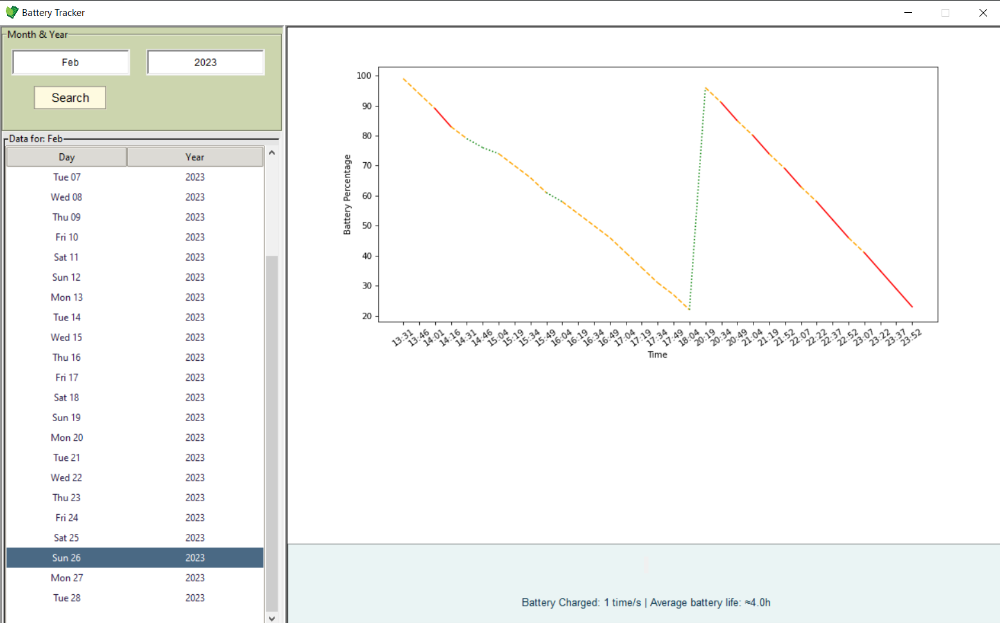

<h1 align="center" >Battery Tracking App</h1>

Our battery tracking app helps users monitor your battery usage.

<h2 align="center" >How it works</h2>

The app works in a way that the main.pyw should be in the startup apps folder and when you turn on the PC it starts. Then the main.pyw app saves battery percentage every 15 minutes in a database where later you can review it with the batteryTracker.pyw app

Before you use the app you should install some libraries so it works properly.

pip3 install psutil matplotlib numpy sqlite3
 

