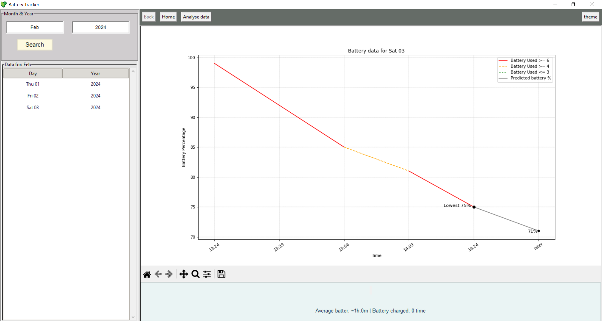

<h1 align="center" >Battery Tracking App</h1>

<h3 align="center">Short explanation how the apps works</h3>

This app is designed to monitor the battery percentage of your device. It saves your percentage every 15 minutes in a database. The main work for storing the data is done by the main.pyw file. Additionally, there is a BatteryTracker.py file where you can view your data through graphs for any day that has been saved in the database.

<h3 align="center">What you need to install</h3>

The app to work properly firstly you need to write this: <strong>pip3 install matplotlib numpy scikit-learn tkinter</strong>

